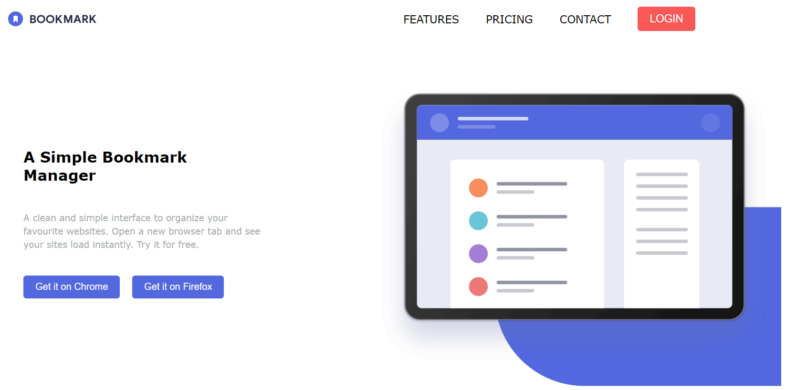

# Bookmark
Bookmark Landing Page
A clean and simple interface to organize your favourite websites. Open a new browser tab and see your sites load instantly. Try it for free.

Our aim is to make it quick and easy for you to access your favourite websites. Your bookmarks sync between your devices so you can access them on the go.

## Built With
- HTML / CSS
- Java Script

## Live Demo

## Getting Started

**This is an example of how you may give instructions on setting up your project locally.**
**Modify this file to match your project, remove sections that don't apply. For example: delete the testing section if the currect project doesn't require testing.**
To get a local copy up and running follow these simple example steps.

### Setup
Follow the link , and the page will open.

### Install
Click on the link.

### Usage
Dowload the extension and install on your browser.

### Deployment
Ver.1.0 Deploy 15 July 2024

## Authors
👤 Stole Boskov 
- GitHub: https://github.com/StoleB

👤 Elena Ilieva
- GitHub: https://github.com/ElenaIlieva22
- LinkedIn: https://www.linkedin.com/in/elena-ilieva-0087498a/

## 🤝 Contributing

Contributions, issues, and feature requests are welcome!

Feel free to check the [issues page](issues/).

## Show your support

Give a ⭐️ if you like this project!

## Acknowledgments

https://chatgpt.com/
https://www.w3schools.com/
https://stackoverflow.com/

## 📝 License

This project is [MIT](lic.url) licensed.
